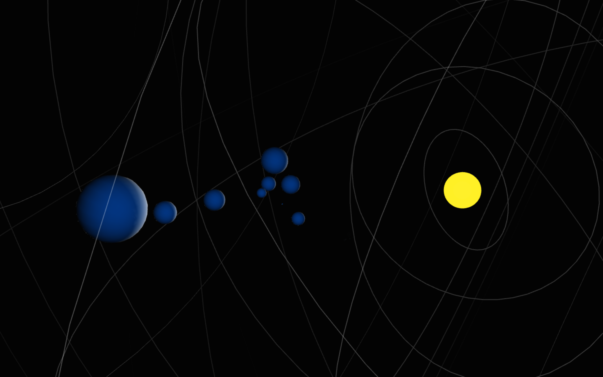

# soularis

A 3-dimensional sequencer analogues to a solar-system.

**[Support my work by becoming a Patron](https://www.patreon.com/bePatron?u=9649817)**



## About

This is a revisit on a project I worked on at the end of 2015. You can watch the previous version here:

- [Soularis 2015 Version](https://youtu.be/PysVJLNAf5E)

The sun is at the center and sends a pulse every n-interval of time (determined by pulse interval, default = 5 sec). The distance the pulse reaches is determined by the pulse radius (default = 50). Planets positioned further than this radius will not be triggered.The time it takes for the pulse to start at the origin and stretch to the maximum radius is determined by the pulse speed (default = 10 sec). When the edge of the pulse hits a planet, it will trigger its sound

Place a planet with the "p" key. Press-and-hold to make the planet larger, when it hits maximum size it will start to shrink again and keeps oscillating between max and min size. A planet is placed 1,5 units between in front of you (in the direction of the sun). You can position planets relative to eachother by looking at the blue-ish casted lighting to determine it's position.

## Controls

```
- SPACE = start/stop the sequencer
- S W   = move forward and backward
- A D   = move sideways
- Z X   = move up-down
- Q E   = rotate around
- P     = place a planet, press+hold to adjust size
- L     = toggle locklook for camera
- G     = hide/show guidelines
```

## Install

Download zip
```
1. download zip
2. unzip
3. open soularis.maxproj
```
Git clone
```
1. $ cd ~/Documents/Max\ 8/Projects
2. $ git clone https://github.com/tmhglnd/soularis.git
3. $ open soularis.maxproj
```

## Dependencies

- `JASCH Package` from Package Manager

## License

The GNU GPL v.3 License
